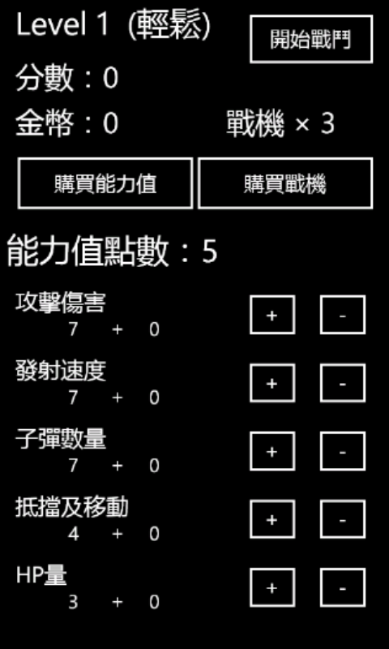
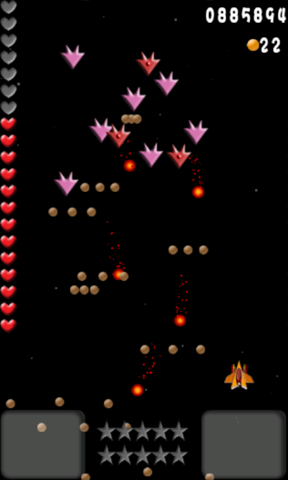
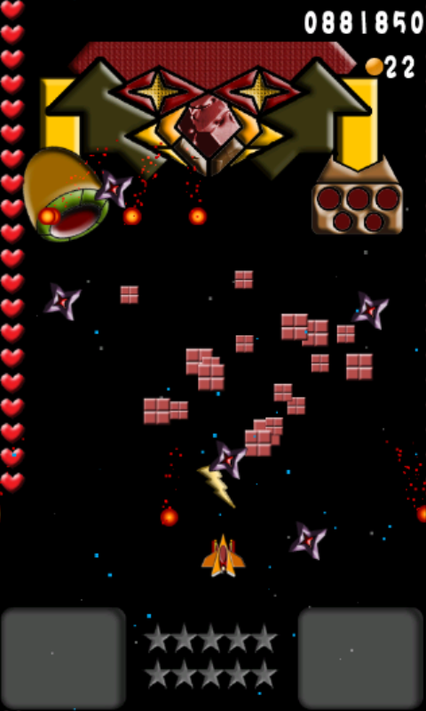
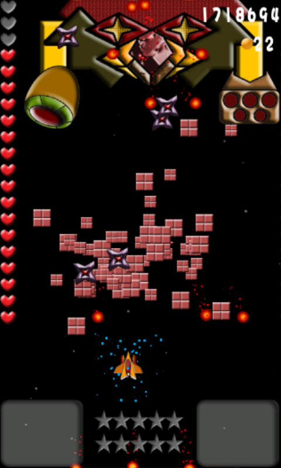
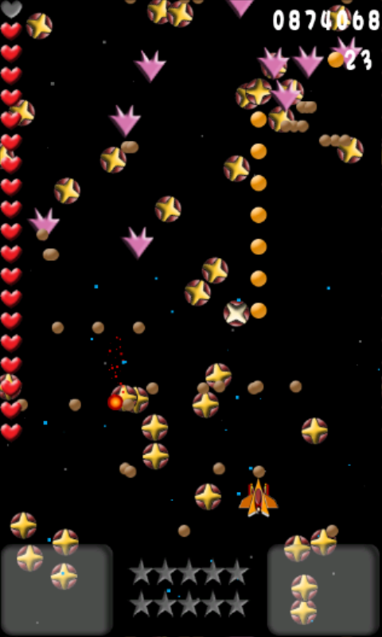
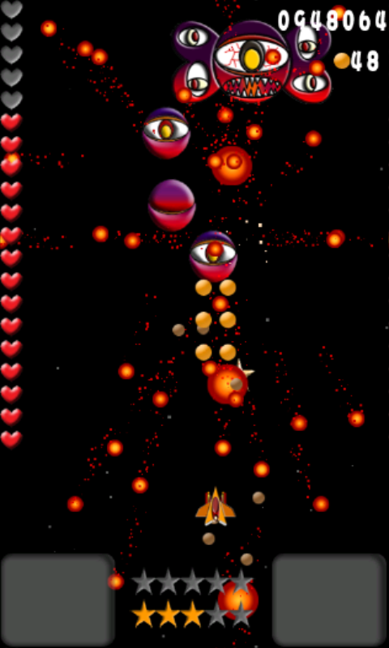

## 最終戰機 (FINAL FIGHTER)

屬性 : WINDOW PHONE APP 

程式語言 : C# + XNA Framework 

完工日期 : 2012年 11月 

工期約 : 1個月半 (含測試) 

原始碼：https://github.com/TaryHuang/FINAL-FIGHTER

遊戲片段：https://www.youtube.com/watch?v=Z86cXK3QjgU 

　　從小很愛玩遊戲，那時就在想遊戲到底是如何被設計出來的，當時的我還沒辦法寫遊戲，而現在的我具備一些物件導向的知識後，就想試試看遊戲這塊領域，於是我到處翻一些線上文件及不斷的想ＸＮＡ遊戲架構．．終於讓我試出來遊戲的架構！　而這款FINAL FIGHTER類似像小蜜蜂，但又多了配點的功能及BOSS關卡，總共有２２關卡...全破至少需要４５分鐘的時間！而為了讓遊戲更有趣味，增加了許多技巧及難度～～～ 

## 遊戲畫面

